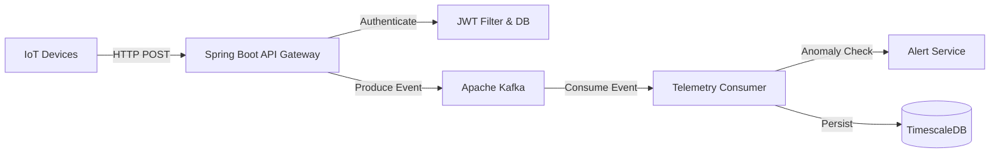

# 🏭 Industrial IoT Data Platform


A high-performance, event-driven backend system designed to simulate an Industry 4.0 environment. This platform manages secure device identities, ingests high-frequency sensor telemetry via Kafka, performs real-time anomaly detection, and stores data in a time-series optimized database.

---

## 🏗 System Architecture

The system follows a reactive, microservices-ready architecture designed for high throughput and scalability.



---

## 🌟 Key Features

**🔐 Device Security:**
* Stateless authentication using **JWT (JSON Web Tokens)**.
* Device secrets are hashed securely using **BCrypt** before storage.
* Role-based access control (RBAC) assigning `ROLE_DEVICE` to authenticated nodes.


**⚡ High-Throughput Ingestion:**
* Non-blocking REST API acts as a gateway.
* Offloads heavy data processing to **Apache Kafka** topics (`telemetry_topic`) to handle burst traffic and prevent system overload.


**📡 Stream Processing:**
* Asynchronous Kafka consumers process telemetry data in the background.
* Decouples data ingestion from storage, ensuring low latency for devices.


**🧠 Real-Time Intelligence:**
* In-stream analysis detects anomalies as they happen (e.g., `Temperature > 100°C`).
* Automatically triggers and persists alerts to the database without manual intervention.


**💾 Time-Series Storage:**
* Data is persisted in **TimescaleDB** (a PostgreSQL extension).
* Optimized for efficient storage and querying of time-series sensor data (hyper-tables).


**🐳 Fully Containerized:**
* The entire stack (Java App, Database, Kafka Broker, Zookeeper, Kafka UI) is defined as code.
* Deployed instantly via **Docker Compose**.


---

## 🛠 Tech Stack

* **Language:** Java 21
* **Framework:** Spring Boot 4.0.1 (Web, Security, Data JPA, Kafka)
* **Messaging:** Apache Kafka & Zookeeper
* **Database:** PostgreSQL 16 + TimescaleDB
* **Build Tool:** Maven
* **DevOps:** Docker & Docker Compose

---

## ⚙️ Configuration

The application is configured to run in a Dockerized environment but can be run locally for development.

**Environment Variables (Docker)**
| Variable | Description |
| :--- | :--- |
| `DB_HOST` | Hostname of the TimescaleDB container |
| `KAFKA_HOST` | Hostname of the Kafka Broker |
| `JWT_SECRET_KEY` | Base64 encoded secret for signing tokens |
| `JWT_EXPIRES_IN` | Token expiration time in milliseconds |

---

## 🚀 Getting Started

### Prerequisites

* Docker & Docker Compose installed.
* *(Optional)* Java 21 SDK if you wish to run the load simulator locally.

### Installation & Deployment

The entire infrastructure is defined in `docker-compose.yml`. You can spin up the full environment with one command.

1. **Clone the repository**
```bash
git clone [https://github.com/yourusername/industry-iot-platform.git](https://github.com/yourusername/industry-iot-platform.git)
cd industry-iot-platform

```


2. **Start the Platform**
This command builds the Java application container and starts Kafka, Zookeeper, and TimescaleDB.
```bash
docker-compose up -d --build

```


3. **Verify Status**
Ensure all containers are running and healthy:
```bash
docker ps
# You should see: iot-backend, iot-kafka, iot-zookeeper, iot-timescaledb, iot-kafka-ui

```


---

## 🔌 API Documentation

### 1. Register a Device

Create a new device identity. The response contains the **API Secret** which is shown only once.

* **Endpoint:** `POST /auth/register`
* **Body:**
```json
{
  "name": "Press-Machine-01",
  "type": "HYDRAULIC_PRESS",
  "firmwareVersion": "v1.2.0"
}

```


### 2. Login (Get Token)

Exchange your Device ID and API Secret for a JWT Access Token.

* **Endpoint:** `POST /auth/login`
* **Body:**
```json
{
  "deviceId": "uuid-from-registration",
  "apiSecret": "secret-from-registration"
}

```


* **Response:** `{"token": "eyJhbGci..."}`

### 3. Send Telemetry

Send sensor data (requires valid JWT in header).

* **Endpoint:** `POST /telemetry`
* **Header:** `Authorization: Bearer <YOUR_TOKEN>`
* **Body:**
```json
{
  "sensorType": "TEMPERATURE",
  "value": 105.5,
  "unit": "CELSIUS"
}

```


---

## 🧪 Load Testing (Simulation)

To verify the system's resilience, a multi-threaded **IoT Simulator** is included in the test suite. It simulates **20 concurrent devices** registering, logging in, and sending burst traffic.

**How to Run the Simulator:**

1. Open the project in IntelliJ IDEA or VS Code.
2. Navigate to `src/test/java/com/industrial/iot_platform/simulation/IotSimulator.java`.
3. Run the `main` method (Java 21 required locally).

**Monitor the Results:**

* **App Logs:** Watch the Docker container logs to see data ingestion in real-time.
```bash
docker logs -f iot-backend

```


* **Kafka UI:** Visit `http://localhost:8000` to visualize topics and message flow.
* **Database:** Verify that data and alerts are being persisted.
```bash
# Check for alerts generated during simulation (Temp > 100)
docker exec -it iot-timescaledb psql -U postgres -d iot_db -c "SELECT * FROM alerts;"

```


---

## 🔮 Future Roadmap

* [ ] **Grafana Dashboard:** Integrate Grafana to visualize real-time temperature trends from TimescaleDB.
* [ ] **Kubernetes Deployment:** Create Helm charts for orchestrating the stack on K8s.
* [ ] **Dynamic Rule Engine:** Allow users to configure alert thresholds via API instead of hardcoded logic.

---

## ✍️ Author

**Siddhanta Shrestha** - *Computer Science Student*
